# Email Connection Flows

This document describes all interaction patterns for the workspace email connection feature, which enables users to connect Gmail (and future email providers) for email outreach campaigns.

## Table of Contents

1. [Architecture Overview](#architecture-overview)
2. [Onboarding Flow](#1-onboarding-email-connection-flow)
3. [Settings Modal Connection](#2-settings-modal-email-connection-flow)
4. [Remove Email Connection](#3-remove-email-connection-flow)
5. [Update Email Connection](#4-update-email-connection-flow)
6. [Reconnection Prompts](#5-reconnection-prompt-flow)
7. [Future Capabilities](#future-capabilities)

---

## Architecture Overview

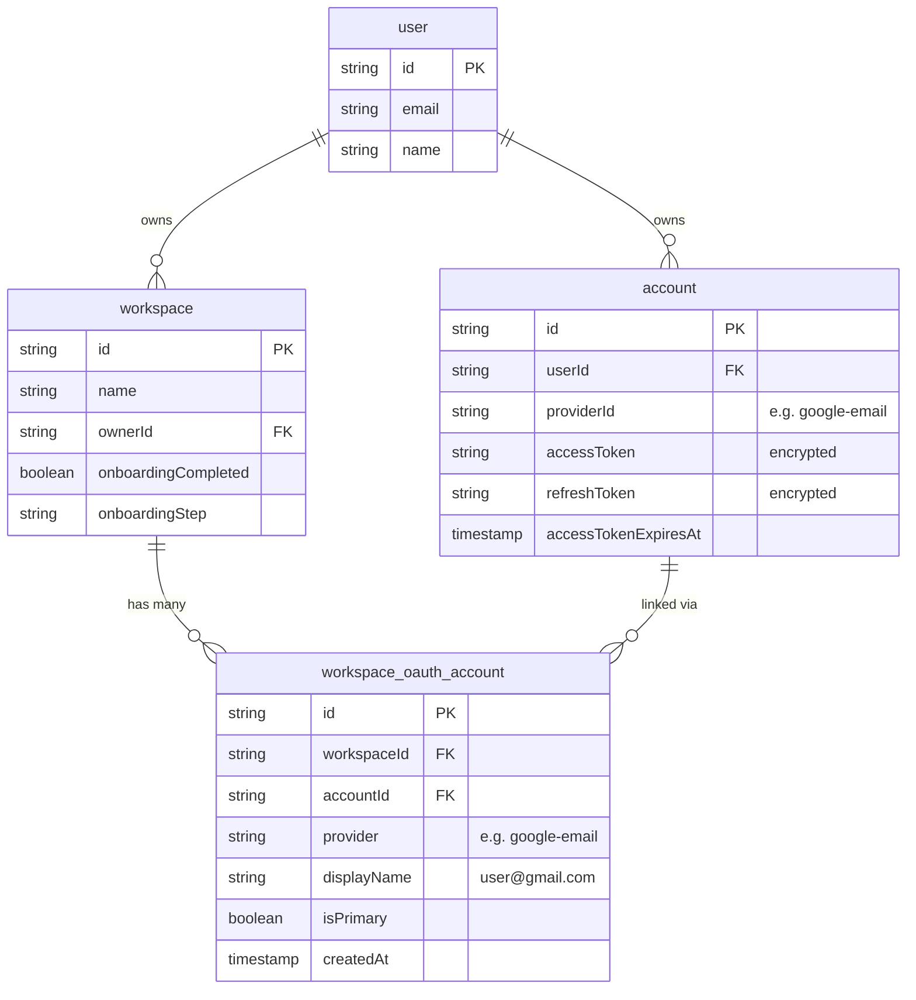
```mermaid
erDiagram
    workspace ||--o{ workspace_oauth_account : "has many"
    account ||--o{ workspace_oauth_account : "linked via"
    user ||--o{ account : "owns"
    user ||--o{ workspace : "owns"

    workspace {
        string id PK
        string name
        string ownerId FK
        boolean onboardingCompleted
        string onboardingStep
    }

    account {
        string id PK
        string userId FK
        string providerId "e.g. google-email"
        string accessToken "encrypted"
        string refreshToken "encrypted"
        timestamp accessTokenExpiresAt
    }

    workspace_oauth_account {
        string id PK
        string workspaceId FK
        string accountId FK
        string provider "e.g. google-email"
        string displayName "user@gmail.com"
        boolean isPrimary
        timestamp createdAt
    }

    user {
        string id PK
        string email
        string name
    }
```

### Key Components

| Component | Purpose |
|-----------|---------|
| `account` table | Stores OAuth tokens (managed by betterAuth) |
| `workspace_oauth_account` table | Junction table linking OAuth accounts to workspaces |
| `client.oauth2.link()` | betterAuth function to initiate OAuth flow |
| `/api/onboarding/.../link-gmail` | API to create workspace-account link during onboarding |
| `/api/workspaces/.../email-accounts` | CRUD API for managing email accounts in settings |

---

## 1. Onboarding Email Connection Flow

This flow occurs during new user onboarding after the Lead Scraper provisioning step.

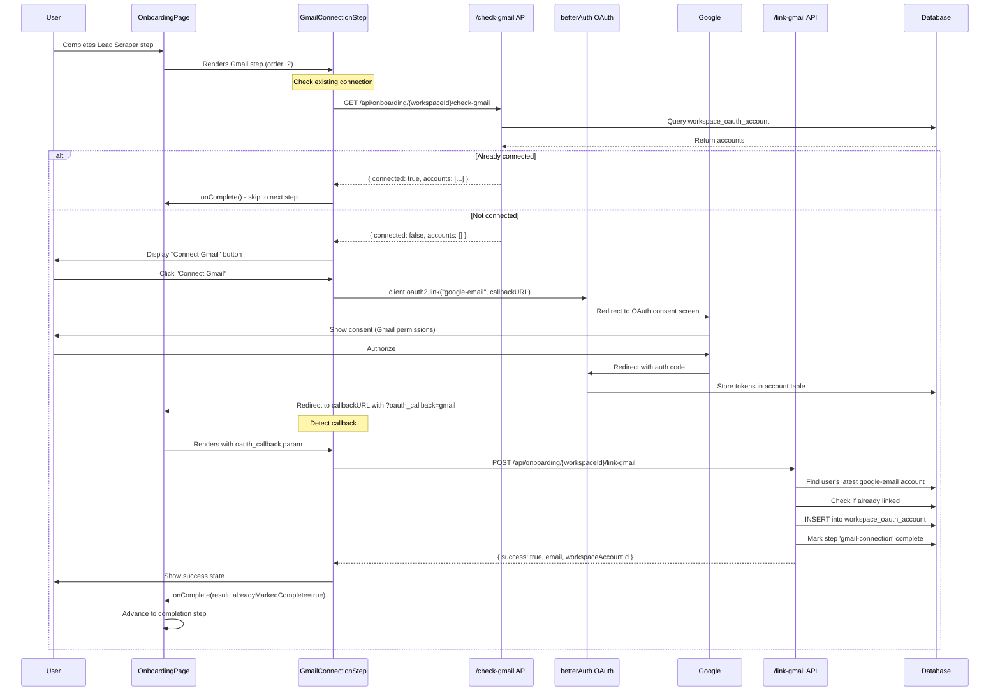
```mermaid
sequenceDiagram
    participant User
    participant OnboardingPage
    participant GmailStep as GmailConnectionStep
    participant CheckAPI as /check-gmail API
    participant BetterAuth as betterAuth OAuth
    participant Google
    participant LinkAPI as /link-gmail API
    participant DB as Database

    User->>OnboardingPage: Completes Lead Scraper step
    OnboardingPage->>GmailStep: Renders Gmail step (order: 2)
    
    Note over GmailStep: Check existing connection
    GmailStep->>CheckAPI: GET /api/onboarding/{workspaceId}/check-gmail
    CheckAPI->>DB: Query workspace_oauth_account
    DB-->>CheckAPI: Return accounts
    
    alt Already connected
        CheckAPI-->>GmailStep: { connected: true, accounts: [...] }
        GmailStep->>OnboardingPage: onComplete() - skip to next step
    else Not connected
        CheckAPI-->>GmailStep: { connected: false, accounts: [] }
        GmailStep->>User: Display "Connect Gmail" button
        
        User->>GmailStep: Click "Connect Gmail"
        GmailStep->>BetterAuth: client.oauth2.link("google-email", callbackURL)
        BetterAuth->>Google: Redirect to OAuth consent screen
        Google->>User: Show consent (Gmail permissions)
        User->>Google: Authorize
        Google->>BetterAuth: Redirect with auth code
        BetterAuth->>DB: Store tokens in account table
        BetterAuth->>OnboardingPage: Redirect to callbackURL with ?oauth_callback=gmail
        
        Note over GmailStep: Detect callback
        OnboardingPage->>GmailStep: Renders with oauth_callback param
        GmailStep->>LinkAPI: POST /api/onboarding/{workspaceId}/link-gmail
        LinkAPI->>DB: Find user's latest google-email account
        LinkAPI->>DB: Check if already linked
        LinkAPI->>DB: INSERT into workspace_oauth_account
        LinkAPI->>DB: Mark step 'gmail-connection' complete
        LinkAPI-->>GmailStep: { success: true, email, workspaceAccountId }
        
        GmailStep->>User: Show success state
        GmailStep->>OnboardingPage: onComplete(result, alreadyMarkedComplete=true)
        OnboardingPage->>OnboardingPage: Advance to completion step
    end
```

### User Experience

1. **Automatic check**: When the step loads, it checks if Gmail is already connected
2. **Clear CTA**: Single "Connect Gmail" button with description
3. **Google OAuth**: User sees Google's familiar consent screen
4. **Automatic linking**: After authorization, account is automatically linked
5. **Success feedback**: Brief success message before advancing
6. **Skip for existing**: If already connected, step auto-completes

---

## 2. Settings Modal Email Connection Flow

Users can connect additional email accounts from workspace settings after onboarding.

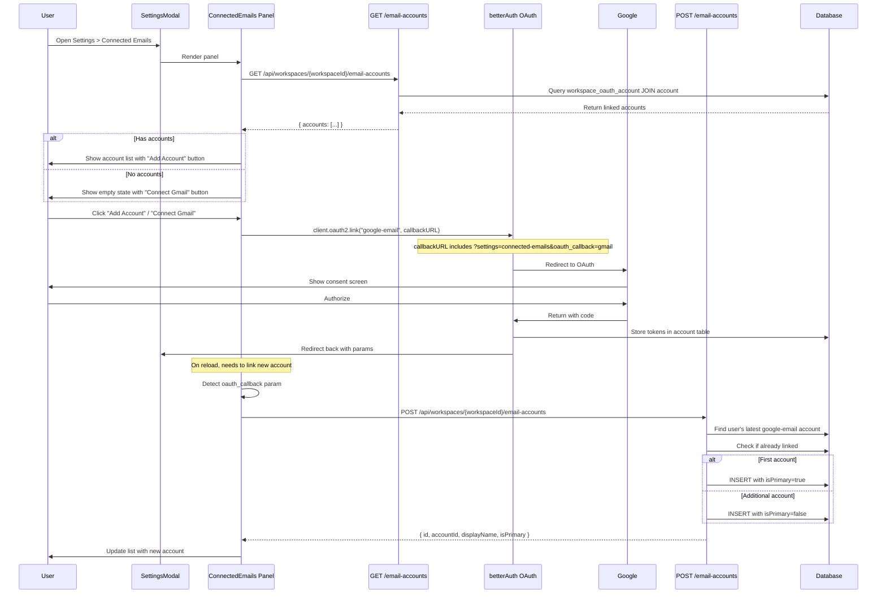
```mermaid
sequenceDiagram
    participant User
    participant SettingsModal
    participant ConnectedEmails as ConnectedEmails Panel
    participant ListAPI as GET /email-accounts
    participant BetterAuth as betterAuth OAuth
    participant Google
    participant PostAPI as POST /email-accounts
    participant DB as Database

    User->>SettingsModal: Open Settings > Connected Emails
    SettingsModal->>ConnectedEmails: Render panel
    ConnectedEmails->>ListAPI: GET /api/workspaces/{workspaceId}/email-accounts
    ListAPI->>DB: Query workspace_oauth_account JOIN account
    DB-->>ListAPI: Return linked accounts
    ListAPI-->>ConnectedEmails: { accounts: [...] }
    
    alt Has accounts
        ConnectedEmails->>User: Show account list with "Add Account" button
    else No accounts
        ConnectedEmails->>User: Show empty state with "Connect Gmail" button
    end
    
    User->>ConnectedEmails: Click "Add Account" / "Connect Gmail"
    ConnectedEmails->>BetterAuth: client.oauth2.link("google-email", callbackURL)
    
    Note over BetterAuth: callbackURL includes ?settings=connected-emails&oauth_callback=gmail
    
    BetterAuth->>Google: Redirect to OAuth
    Google->>User: Show consent screen
    User->>Google: Authorize
    Google->>BetterAuth: Return with code
    BetterAuth->>DB: Store tokens in account table
    BetterAuth->>SettingsModal: Redirect back with params
    
    Note over ConnectedEmails: On reload, needs to link new account
    ConnectedEmails->>ConnectedEmails: Detect oauth_callback param
    ConnectedEmails->>PostAPI: POST /api/workspaces/{workspaceId}/email-accounts
    PostAPI->>DB: Find user's latest google-email account
    PostAPI->>DB: Check if already linked
    
    alt First account
        PostAPI->>DB: INSERT with isPrimary=true
    else Additional account
        PostAPI->>DB: INSERT with isPrimary=false
    end
    
    PostAPI-->>ConnectedEmails: { id, accountId, displayName, isPrimary }
    ConnectedEmails->>User: Update list with new account
```

### User Experience

1. **Easy access**: Settings > Tools > Connected Emails
2. **Account list**: Shows all connected emails with primary badge
3. **Add more**: "Add Account" button for multi-account support
4. **Same OAuth flow**: Consistent Google authorization experience
5. **Instant update**: List updates immediately after connection

---

## 3. Remove Email Connection Flow

Users can disconnect email accounts from the workspace.

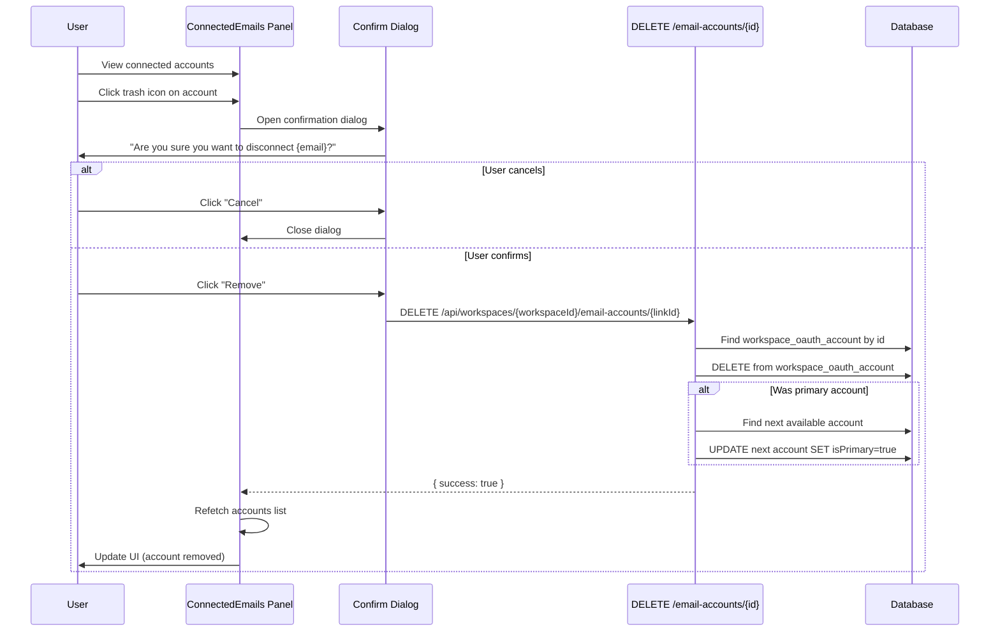
```mermaid
sequenceDiagram
    participant User
    participant ConnectedEmails as ConnectedEmails Panel
    participant Dialog as Confirm Dialog
    participant DeleteAPI as DELETE /email-accounts/{id}
    participant DB as Database

    User->>ConnectedEmails: View connected accounts
    User->>ConnectedEmails: Click trash icon on account
    ConnectedEmails->>Dialog: Open confirmation dialog
    
    Dialog->>User: "Are you sure you want to disconnect {email}?"
    
    alt User cancels
        User->>Dialog: Click "Cancel"
        Dialog->>ConnectedEmails: Close dialog
    else User confirms
        User->>Dialog: Click "Remove"
        Dialog->>DeleteAPI: DELETE /api/workspaces/{workspaceId}/email-accounts/{linkId}
        
        DeleteAPI->>DB: Find workspace_oauth_account by id
        DeleteAPI->>DB: DELETE from workspace_oauth_account
        
        alt Was primary account
            DeleteAPI->>DB: Find next available account
            DeleteAPI->>DB: UPDATE next account SET isPrimary=true
        end
        
        DeleteAPI-->>ConnectedEmails: { success: true }
        ConnectedEmails->>ConnectedEmails: Refetch accounts list
        ConnectedEmails->>User: Update UI (account removed)
    end
```

### Important Notes

- **Only removes link**: The OAuth account in the `account` table remains (user may use it elsewhere)
- **Auto-promotes primary**: If you remove the primary account, another becomes primary
- **Confirmation required**: Destructive action requires user confirmation
- **No cascade to campaigns**: Active campaigns using this account should be handled separately (future consideration)

---

## 4. Update Email Connection Flow

Currently supports setting an account as primary.

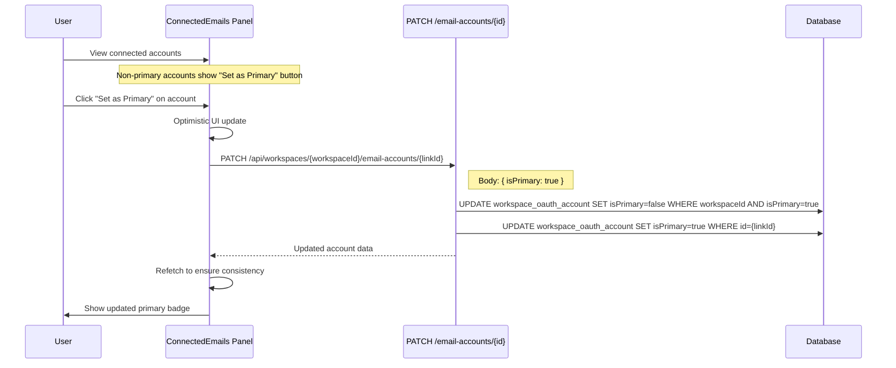
```mermaid
sequenceDiagram
    participant User
    participant ConnectedEmails as ConnectedEmails Panel
    participant PatchAPI as PATCH /email-accounts/{id}
    participant DB as Database

    User->>ConnectedEmails: View connected accounts
    
    Note over ConnectedEmails: Non-primary accounts show "Set as Primary" button
    
    User->>ConnectedEmails: Click "Set as Primary" on account
    ConnectedEmails->>ConnectedEmails: Optimistic UI update
    
    ConnectedEmails->>PatchAPI: PATCH /api/workspaces/{workspaceId}/email-accounts/{linkId}
    Note right of PatchAPI: Body: { isPrimary: true }
    
    PatchAPI->>DB: UPDATE workspace_oauth_account SET isPrimary=false WHERE workspaceId AND isPrimary=true
    PatchAPI->>DB: UPDATE workspace_oauth_account SET isPrimary=true WHERE id={linkId}
    
    PatchAPI-->>ConnectedEmails: Updated account data
    ConnectedEmails->>ConnectedEmails: Refetch to ensure consistency
    ConnectedEmails->>User: Show updated primary badge
```

### User Experience

- **Clear indication**: Primary account shows crown badge
- **One-click action**: Simple "Set as Primary" button
- **Optimistic updates**: UI updates immediately
- **Background sync**: Refetch ensures data consistency

---

## 5. Reconnection Prompt Flow

When OAuth tokens expire or are revoked, users need to reconnect.

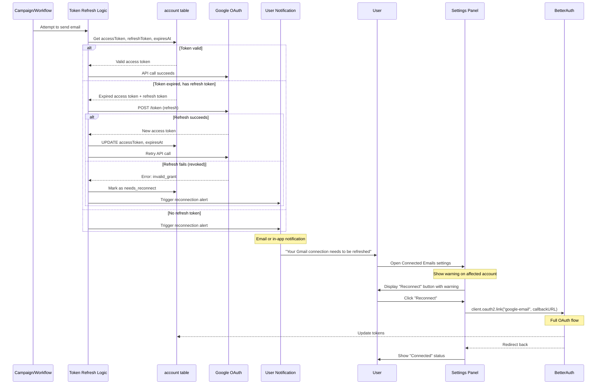
```mermaid
sequenceDiagram
    participant System as Campaign/Workflow
    participant TokenRefresh as Token Refresh Logic
    participant Account as account table
    participant Google as Google OAuth
    participant Notification as User Notification
    participant User
    participant ConnectedEmails as Settings Panel
    participant BetterAuth

    System->>TokenRefresh: Attempt to send email
    TokenRefresh->>Account: Get accessToken, refreshToken, expiresAt
    
    alt Token valid
        Account-->>TokenRefresh: Valid access token
        TokenRefresh->>Google: API call succeeds
    else Token expired, has refresh token
        Account-->>TokenRefresh: Expired access token + refresh token
        TokenRefresh->>Google: POST /token (refresh)
        
        alt Refresh succeeds
            Google-->>TokenRefresh: New access token
            TokenRefresh->>Account: UPDATE accessToken, expiresAt
            TokenRefresh->>Google: Retry API call
        else Refresh fails (revoked)
            Google-->>TokenRefresh: Error: invalid_grant
            TokenRefresh->>Account: Mark as needs_reconnect
            TokenRefresh->>Notification: Trigger reconnection alert
        end
    else No refresh token
        TokenRefresh->>Notification: Trigger reconnection alert
    end
    
    Note over Notification: Email or in-app notification
    
    Notification->>User: "Your Gmail connection needs to be refreshed"
    User->>ConnectedEmails: Open Connected Emails settings
    
    Note over ConnectedEmails: Show warning on affected account
    
    ConnectedEmails->>User: Display "Reconnect" button with warning
    User->>ConnectedEmails: Click "Reconnect"
    ConnectedEmails->>BetterAuth: client.oauth2.link("google-email", callbackURL)
    
    Note over BetterAuth: Full OAuth flow
    
    BetterAuth-->>Account: Update tokens
    BetterAuth-->>ConnectedEmails: Redirect back
    ConnectedEmails->>User: Show "Connected" status
```

### Reconnection Triggers

| Trigger | Detection | User Experience |
|---------|-----------|-----------------|
| **Access token expired** | `accessTokenExpiresAt < now()` | Automatic refresh (no user action) |
| **Refresh token expired** | Refresh API returns `invalid_grant` | User must reconnect |
| **User revoked access** | API returns `401/403` | User must reconnect |
| **Scope changes** | API returns scope error | User must reconnect with new scopes |

### Future Enhancement: Proactive Monitoring

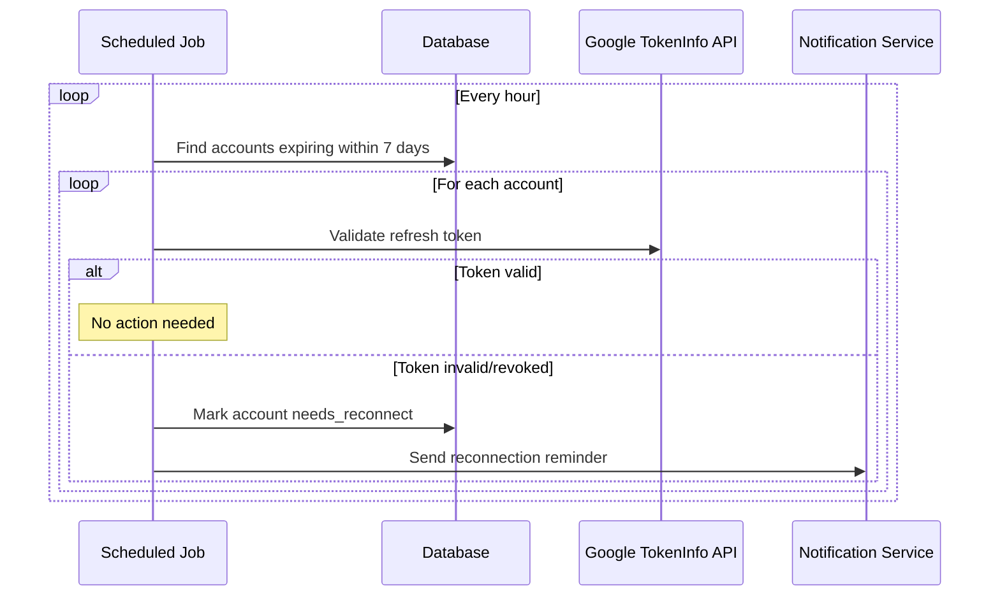
```mermaid
sequenceDiagram
    participant Cron as Scheduled Job
    participant DB as Database
    participant Google as Google TokenInfo API
    participant Notification as Notification Service

    loop Every hour
        Cron->>DB: Find accounts expiring within 7 days
        
        loop For each account
            Cron->>Google: Validate refresh token
            
            alt Token valid
                Note over Cron: No action needed
            else Token invalid/revoked
                Cron->>DB: Mark account needs_reconnect
                Cron->>Notification: Send reconnection reminder
            end
        end
    end
```

---

## Future Capabilities

The current architecture enables powerful email features:

### 1. Email Tracking Architecture (Reply Detection)

> **Key Insight**: We DON'T sync the user's entire inbox. We only track:
> 1. Emails WE send through the platform
> 2. Replies to those emails
>
> This dramatically reduces API calls and avoids storing irrelevant data.

#### Why NOT Poll or Full Sync?

| Approach | Problem |
|----------|---------|
| **Poll inbox every X minutes** | Rate limits (Gmail allows ~250 quota units/user/second, listing uses 5 units each) |
| **Sync entire inbox** | Wasteful storage, privacy concerns, most emails are irrelevant |
| **Sync all threads** | Exponential data growth, slow, expensive |

#### The Right Approach: Track What We Send + Push Notifications

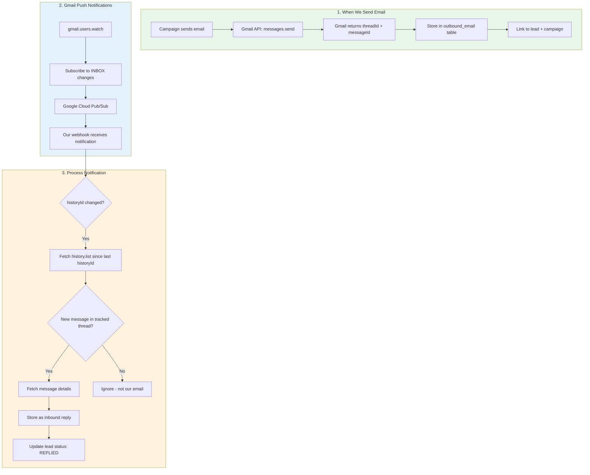
```mermaid
flowchart TD
    subgraph Send ["1. When We Send Email"]
        A[Campaign sends email] --> B[Gmail API: messages.send]
        B --> C[Gmail returns threadId + messageId]
        C --> D[Store in outbound_email table]
        D --> E[Link to lead + campaign]
    end
    
    subgraph Watch ["2. Gmail Push Notifications"]
        F[gmail.users.watch] --> G[Subscribe to INBOX changes]
        G --> H[Google Cloud Pub/Sub]
        H --> I[Our webhook receives notification]
    end
    
    subgraph Process ["3. Process Notification"]
        I --> J{historyId changed?}
        J -->|Yes| K[Fetch history.list since last historyId]
        K --> L{New message in tracked thread?}
        L -->|Yes| M[Fetch message details]
        M --> N[Store as inbound reply]
        N --> O[Update lead status: REPLIED]
        L -->|No| P[Ignore - not our email]
    end
    
    style Send fill:#e8f5e9
    style Watch fill:#e3f2fd
    style Process fill:#fff3e0
```

#### Gmail Push Notifications (Not Polling!)

Gmail provides a push notification system via Google Cloud Pub/Sub:

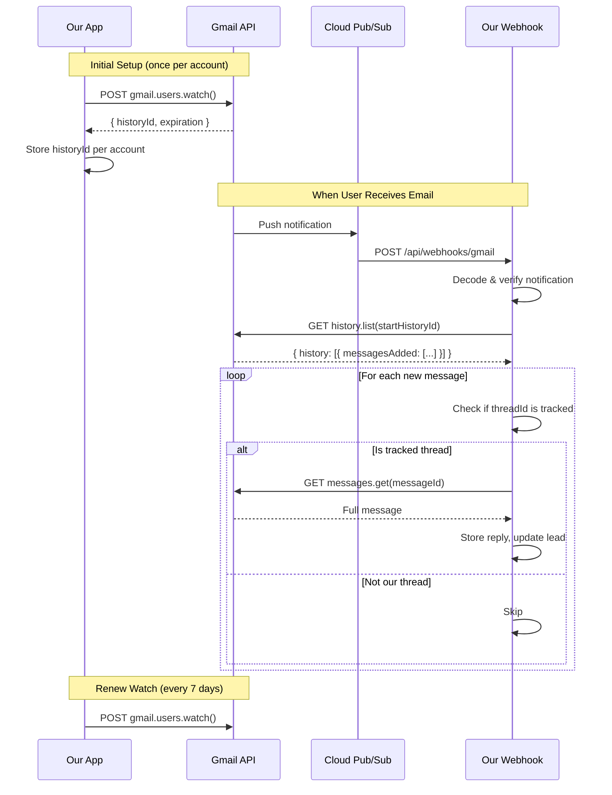
```mermaid
sequenceDiagram
    participant App as Our App
    participant Gmail as Gmail API
    participant PubSub as Cloud Pub/Sub
    participant Webhook as Our Webhook
    
    Note over App,Gmail: Initial Setup (once per account)
    App->>Gmail: POST gmail.users.watch()
    Gmail-->>App: { historyId, expiration }
    App->>App: Store historyId per account
    
    Note over Gmail,Webhook: When User Receives Email
    Gmail->>PubSub: Push notification
    PubSub->>Webhook: POST /api/webhooks/gmail
    Webhook->>Webhook: Decode & verify notification
    Webhook->>Gmail: GET history.list(startHistoryId)
    Gmail-->>Webhook: { history: [{ messagesAdded: [...] }] }
    
    loop For each new message
        Webhook->>Webhook: Check if threadId is tracked
        alt Is tracked thread
            Webhook->>Gmail: GET messages.get(messageId)
            Gmail-->>Webhook: Full message
            Webhook->>Webhook: Store reply, update lead
        else Not our thread
            Webhook->>Webhook: Skip
        end
    end
    
    Note over App,Gmail: Renew Watch (every 7 days)
    App->>Gmail: POST gmail.users.watch()
```

#### Why This Scales

| Metric | Polling Approach | Push Notification Approach |
|--------|------------------|---------------------------|
| **API calls per user/day** | 1,440+ (every minute) | 1-50 (only when emails arrive) |
| **Latency** | Up to 60s delay | Near real-time (~seconds) |
| **Rate limit risk** | High | Very low |
| **1000 users** | 1.44M API calls/day | ~50K API calls/day |

#### Quota-Aware Processing

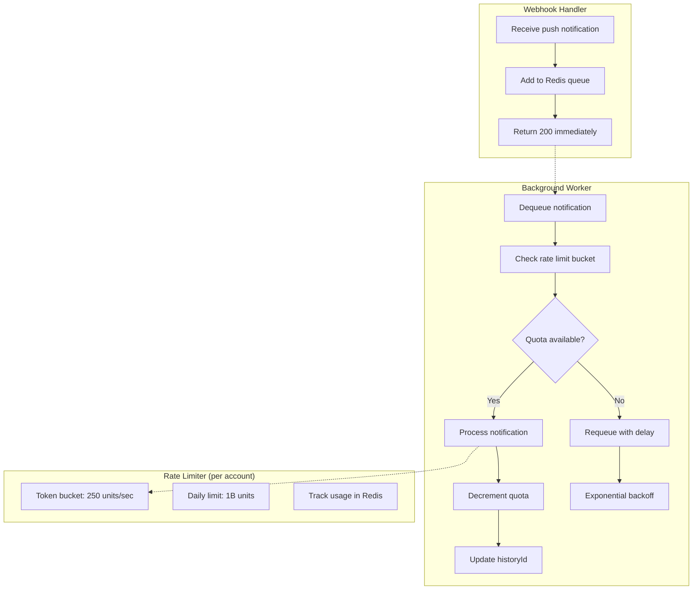
```mermaid
flowchart TD
    subgraph Webhook ["Webhook Handler"]
        A[Receive push notification] --> B[Add to Redis queue]
        B --> C[Return 200 immediately]
    end
    
    subgraph Worker ["Background Worker"]
        D[Dequeue notification] --> E[Check rate limit bucket]
        E --> F{Quota available?}
        F -->|Yes| G[Process notification]
        G --> H[Decrement quota]
        H --> I[Update historyId]
        F -->|No| J[Requeue with delay]
        J --> K[Exponential backoff]
    end
    
    subgraph RateLimiter ["Rate Limiter (per account)"]
        L[Token bucket: 250 units/sec]
        M[Daily limit: 1B units]
        N[Track usage in Redis]
    end
    
    C -.-> D
    G -.-> L
```

#### Proposed Schema: Efficient Reply Tracking

```typescript
/**
 * Tracks emails sent by our platform.
 * We only store what WE send - not the user's entire inbox.
 */
export const outboundEmail = pgTable('outbound_email', {
  id: text('id').primaryKey(),
  workspaceId: text('workspace_id').notNull()
    .references(() => workspace.id, { onDelete: 'cascade' }),
  senderAccountId: text('sender_account_id').notNull()
    .references(() => workspaceOAuthAccount.id, { onDelete: 'cascade' }),
  
  // Gmail identifiers - used to match replies
  gmailThreadId: text('gmail_thread_id').notNull(),
  gmailMessageId: text('gmail_message_id').notNull(),
  
  // Links to our data model
  campaignId: text('campaign_id'), // Link to campaigns table
  leadId: text('lead_id'),         // Link to leads table
  
  // Email metadata
  toEmail: text('to_email').notNull(),
  subject: text('subject'),
  sentAt: timestamp('sent_at').notNull(),
  
  // Reply tracking
  replyCount: integer('reply_count').notNull().default(0),
  lastReplyAt: timestamp('last_reply_at'),
  hasReply: boolean('has_reply').notNull().default(false),
  
  createdAt: timestamp('created_at').notNull().defaultNow(),
}, (table) => ({
  // Fast lookup when processing Gmail notifications
  threadIdIdx: index('outbound_email_thread_id_idx').on(table.gmailThreadId),
  senderAccountIdx: index('outbound_email_sender_idx').on(table.senderAccountId),
  campaignIdx: index('outbound_email_campaign_idx').on(table.campaignId),
  leadIdx: index('outbound_email_lead_idx').on(table.leadId),
}))

/**
 * Stores replies to emails we sent.
 * Only created when we detect a reply in a tracked thread.
 */
export const emailReply = pgTable('email_reply', {
  id: text('id').primaryKey(),
  outboundEmailId: text('outbound_email_id').notNull()
    .references(() => outboundEmail.id, { onDelete: 'cascade' }),
  
  // Gmail identifiers
  gmailMessageId: text('gmail_message_id').notNull().unique(),
  
  // Reply metadata
  fromEmail: text('from_email').notNull(),
  subject: text('subject'),
  snippet: text('snippet'),          // First ~100 chars
  bodyText: text('body_text'),       // Plain text version
  receivedAt: timestamp('received_at').notNull(),
  
  // Classification (future: AI-powered)
  sentiment: text('sentiment'),       // 'positive' | 'negative' | 'neutral'
  isAutoReply: boolean('is_auto_reply').default(false),
  isOutOfOffice: boolean('is_out_of_office').default(false),
  
  createdAt: timestamp('created_at').notNull().defaultNow(),
})

/**
 * Tracks Gmail watch subscription status per account.
 * Watch expires every 7 days and must be renewed.
 */
export const gmailWatchSubscription = pgTable('gmail_watch_subscription', {
  id: text('id').primaryKey(),
  workspaceOAuthAccountId: text('workspace_oauth_account_id').notNull()
    .references(() => workspaceOAuthAccount.id, { onDelete: 'cascade' })
    .unique(),
  
  // Gmail watch state
  historyId: text('history_id').notNull(),
  expiresAt: timestamp('expires_at').notNull(),
  
  // For debugging and monitoring
  lastNotificationAt: timestamp('last_notification_at'),
  notificationCount: integer('notification_count').default(0),
  
  createdAt: timestamp('created_at').notNull().defaultNow(),
  updatedAt: timestamp('updated_at').notNull().defaultNow(),
})

/**
 * Rate limiting and quota tracking per account.
 */
export const gmailQuotaUsage = pgTable('gmail_quota_usage', {
  id: text('id').primaryKey(),
  workspaceOAuthAccountId: text('workspace_oauth_account_id').notNull()
    .references(() => workspaceOAuthAccount.id, { onDelete: 'cascade' }),
  
  date: text('date').notNull(),  // YYYY-MM-DD
  quotaUnitsUsed: integer('quota_units_used').notNull().default(0),
  
  // Breakdown by operation type
  sendCount: integer('send_count').default(0),
  historyListCount: integer('history_list_count').default(0),
  messageGetCount: integer('message_get_count').default(0),
}, (table) => ({
  accountDateIdx: uniqueIndex('gmail_quota_account_date_idx')
    .on(table.workspaceOAuthAccountId, table.date),
}))
```

#### Reply Processing Flow

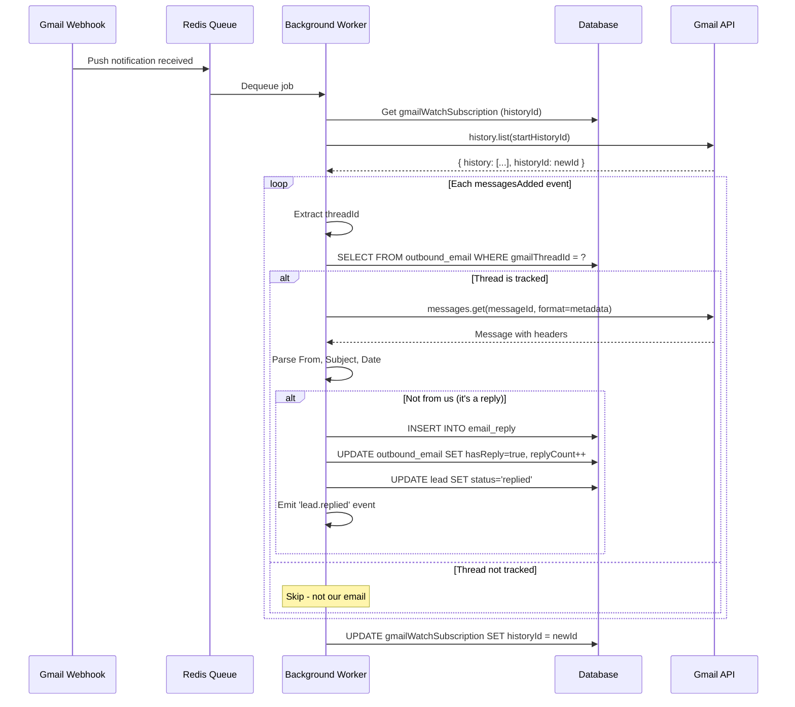
```mermaid
sequenceDiagram
    participant Webhook as Gmail Webhook
    participant Queue as Redis Queue
    participant Worker as Background Worker
    participant DB as Database
    participant Gmail as Gmail API

    Webhook->>Queue: Push notification received
    Queue->>Worker: Dequeue job
    
    Worker->>DB: Get gmailWatchSubscription (historyId)
    Worker->>Gmail: history.list(startHistoryId)
    Gmail-->>Worker: { history: [...], historyId: newId }
    
    loop Each messagesAdded event
        Worker->>Worker: Extract threadId
        Worker->>DB: SELECT FROM outbound_email WHERE gmailThreadId = ?
        
        alt Thread is tracked
            Worker->>Gmail: messages.get(messageId, format=metadata)
            Gmail-->>Worker: Message with headers
            Worker->>Worker: Parse From, Subject, Date
            
            alt Not from us (it's a reply)
                Worker->>DB: INSERT INTO email_reply
                Worker->>DB: UPDATE outbound_email SET hasReply=true, replyCount++
                Worker->>DB: UPDATE lead SET status='replied'
                Worker->>Worker: Emit 'lead.replied' event
            end
        else Thread not tracked
            Note over Worker: Skip - not our email
        end
    end
    
    Worker->>DB: UPDATE gmailWatchSubscription SET historyId = newId
```

#### Handling Edge Cases

| Scenario | Solution |
|----------|----------|
| **Watch expires (7 days)** | Cron job renews before expiration |
| **historyId gap** | If history.list returns error, do partial sync of tracked threads only |
| **Duplicate notifications** | Idempotent processing via unique gmailMessageId |
| **Account disconnected** | Mark watch as inactive, stop processing |
| **Rate limit hit** | Exponential backoff, requeue with delay |
| **Out-of-office reply** | Detect via headers, don't count as real reply |

#### Watch Renewal Cron Job

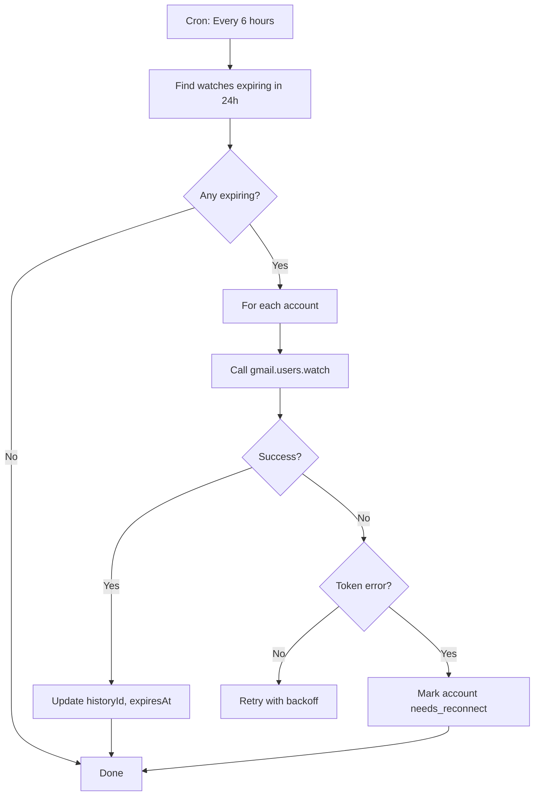
```mermaid
flowchart TD
    A[Cron: Every 6 hours] --> B[Find watches expiring in 24h]
    B --> C{Any expiring?}
    C -->|Yes| D[For each account]
    D --> E[Call gmail.users.watch]
    E --> F{Success?}
    F -->|Yes| G[Update historyId, expiresAt]
    F -->|No| H{Token error?}
    H -->|Yes| I[Mark account needs_reconnect]
    H -->|No| J[Retry with backoff]
    C -->|No| K[Done]
    G --> K
    I --> K
```

### 2. Email Sending from Platform

#### Gmail Sending Limits (Critical Knowledge)

| Limit Type | Free Gmail | Google Workspace |
|------------|-----------|------------------|
| **Daily send limit** | 500 emails/day | 2,000 emails/day |
| **Per-minute limit** | ~20 emails/min | ~100 emails/min |
| **API quota** | 250 units/user/sec | 250 units/user/sec |
| **messages.send cost** | 100 quota units | 100 quota units |

> **Implication**: A single Gmail account can send ~2,000 emails/day max.
> For scale, we need **multi-account rotation** + **intelligent rate limiting**.

#### Production-Ready Sending Architecture

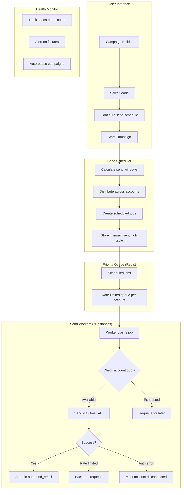
```mermaid
flowchart TD
    subgraph UI ["User Interface"]
        A[Campaign Builder] --> B[Select leads]
        B --> C[Configure send schedule]
        C --> D[Start Campaign]
    end
    
    subgraph Scheduler ["Send Scheduler"]
        D --> E[Calculate send windows]
        E --> F[Distribute across accounts]
        F --> G[Create scheduled jobs]
        G --> H[Store in email_send_job table]
    end
    
    subgraph Queue ["Priority Queue (Redis)"]
        H --> I[Scheduled jobs]
        I --> J[Rate-limited queue per account]
    end
    
    subgraph Workers ["Send Workers (N instances)"]
        J --> K[Worker claims job]
        K --> L{Check account quota}
        L -->|Available| M[Send via Gmail API]
        L -->|Exhausted| N[Requeue for later]
        M --> O{Success?}
        O -->|Yes| P[Store in outbound_email]
        O -->|Rate limited| Q[Backoff + requeue]
        O -->|Auth error| R[Mark account disconnected]
    end
    
    subgraph Monitor ["Health Monitor"]
        S[Track sends per account]
        T[Alert on failures]
        U[Auto-pause campaigns]
    end
```

#### Rate Limiting Strategy

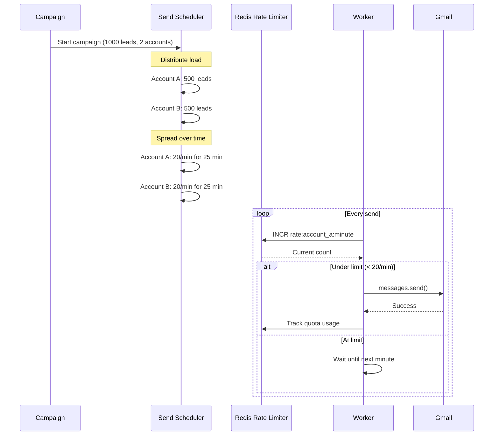
```mermaid
sequenceDiagram
    participant Campaign
    participant Scheduler as Send Scheduler
    participant Redis as Redis Rate Limiter
    participant Worker
    participant Gmail

    Campaign->>Scheduler: Start campaign (1000 leads, 2 accounts)
    
    Note over Scheduler: Distribute load
    Scheduler->>Scheduler: Account A: 500 leads
    Scheduler->>Scheduler: Account B: 500 leads
    
    Note over Scheduler: Spread over time
    Scheduler->>Scheduler: Account A: 20/min for 25 min
    Scheduler->>Scheduler: Account B: 20/min for 25 min
    
    loop Every send
        Worker->>Redis: INCR rate:account_a:minute
        Redis-->>Worker: Current count
        
        alt Under limit (< 20/min)
            Worker->>Gmail: messages.send()
            Gmail-->>Worker: Success
            Worker->>Redis: Track quota usage
        else At limit
            Worker->>Worker: Wait until next minute
        end
    end
```

#### Token Bucket Rate Limiter (Per Account)

```typescript
/**
 * Redis-based token bucket for Gmail rate limiting.
 * Each account gets its own bucket with configurable rates.
 */
interface RateLimitConfig {
  // Per-minute limits (conservative)
  emailsPerMinute: number      // 15 for safety (Gmail allows ~20)
  
  // Per-day limits
  emailsPerDay: number         // 450 for free, 1800 for Workspace
  
  // API quota
  quotaUnitsPerSecond: number  // 200 for safety (Gmail allows 250)
}

const RATE_LIMITS: Record<string, RateLimitConfig> = {
  'gmail-free': {
    emailsPerMinute: 15,
    emailsPerDay: 450,
    quotaUnitsPerSecond: 200,
  },
  'gmail-workspace': {
    emailsPerMinute: 80,
    emailsPerDay: 1800,
    quotaUnitsPerSecond: 200,
  },
}
```

#### Intelligent Send Scheduling

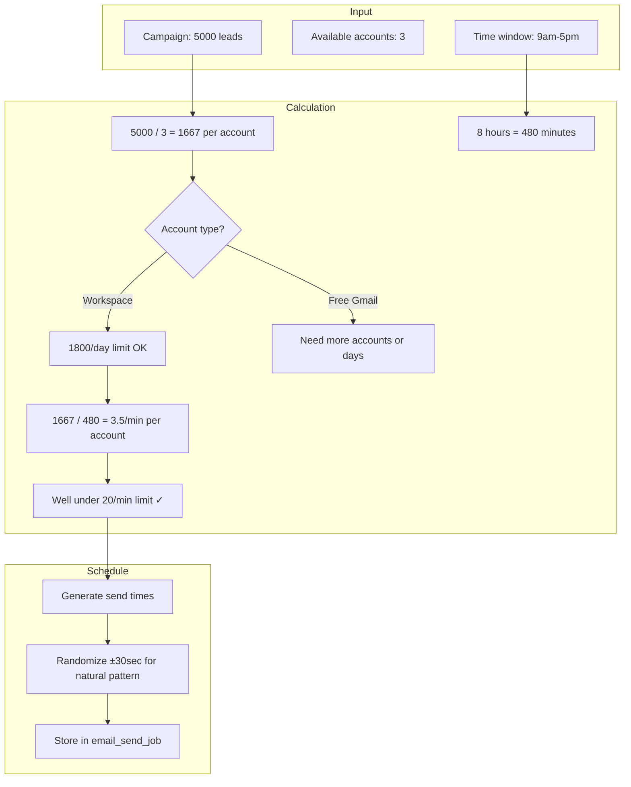
```mermaid
flowchart TD
    subgraph Input
        A[Campaign: 5000 leads]
        B[Available accounts: 3]
        C[Time window: 9am-5pm]
    end
    
    subgraph Calculation
        A --> D[5000 / 3 = 1667 per account]
        D --> E{Account type?}
        E -->|Workspace| F[1800/day limit OK]
        E -->|Free Gmail| G[Need more accounts or days]
        
        C --> H[8 hours = 480 minutes]
        F --> I[1667 / 480 = 3.5/min per account]
        I --> J[Well under 20/min limit ✓]
    end
    
    subgraph Schedule
        J --> K[Generate send times]
        K --> L[Randomize ±30sec for natural pattern]
        L --> M[Store in email_send_job]
    end
```

#### Multi-Account Rotation

```mermaid
flowchart LR
    subgraph Accounts ["Connected Accounts"]
        A1[sales@company.com<br/>Workspace - 1800/day]
        A2[outreach@company.com<br/>Workspace - 1800/day]
        A3[team@company.com<br/>Free - 450/day]
    end
    
    subgraph Distribution ["Daily Capacity: 4050 emails"]
        A1 --> D1[1800 emails]
        A2 --> D2[1800 emails]
        A3 --> D3[450 emails]
    end
    
    subgraph Strategy
        S1[Round-robin by default]
        S2[Weighted by daily limit]
        S3[Skip exhausted accounts]
    end
```

#### Proposed Email Sending Schema

```typescript
/**
 * Email campaign definition.
 */
export const emailCampaign = pgTable('email_campaign', {
  id: text('id').primaryKey(),
  workspaceId: text('workspace_id').notNull()
    .references(() => workspace.id, { onDelete: 'cascade' }),
  
  name: text('name').notNull(),
  status: text('status').notNull().default('draft'),
    // 'draft' | 'scheduled' | 'sending' | 'paused' | 'completed' | 'cancelled'
  
  // Email content
  subject: text('subject').notNull(),
  bodyHtml: text('body_html').notNull(),
  bodyText: text('body_text'),
  
  // Sender configuration
  senderAccountIds: text('sender_account_ids').array(), // Multiple accounts for rotation
  rotationStrategy: text('rotation_strategy').default('round-robin'),
    // 'round-robin' | 'weighted' | 'random'
  
  // Scheduling
  sendStartTime: text('send_start_time'),   // "09:00" (lead's timezone)
  sendEndTime: text('send_end_time'),       // "17:00"
  sendDays: text('send_days').array(),      // ['mon', 'tue', 'wed', 'thu', 'fri']
  maxPerDay: integer('max_per_day'),        // Cap per day
  maxPerMinute: integer('max_per_minute'),  // Cap per minute
  
  // Stats (denormalized for quick access)
  totalLeads: integer('total_leads').default(0),
  sentCount: integer('sent_count').default(0),
  replyCount: integer('reply_count').default(0),
  failedCount: integer('failed_count').default(0),
  
  createdAt: timestamp('created_at').notNull().defaultNow(),
  updatedAt: timestamp('updated_at').notNull().defaultNow(),
})

/**
 * Individual send job - one per lead per campaign.
 */
export const emailSendJob = pgTable('email_send_job', {
  id: text('id').primaryKey(),
  campaignId: text('campaign_id').notNull()
    .references(() => emailCampaign.id, { onDelete: 'cascade' }),
  leadId: text('lead_id').notNull(),
  
  // Assigned sender (set when scheduled)
  senderAccountId: text('sender_account_id')
    .references(() => workspaceOAuthAccount.id),
  
  // Scheduling
  scheduledAt: timestamp('scheduled_at'),
  
  // Status tracking
  status: text('status').notNull().default('pending'),
    // 'pending' | 'scheduled' | 'sending' | 'sent' | 'failed' | 'cancelled'
  
  // Personalized content (rendered at schedule time)
  renderedSubject: text('rendered_subject'),
  renderedBodyHtml: text('rendered_body_html'),
  
  // Execution tracking
  attempts: integer('attempts').default(0),
  lastAttemptAt: timestamp('last_attempt_at'),
  sentAt: timestamp('sent_at'),
  
  // On success, links to outbound_email for reply tracking
  outboundEmailId: text('outbound_email_id')
    .references(() => outboundEmail.id),
  
  // On failure
  errorCode: text('error_code'),
  errorMessage: text('error_message'),
  
  createdAt: timestamp('created_at').notNull().defaultNow(),
}, (table) => ({
  campaignStatusIdx: index('email_send_job_campaign_status_idx')
    .on(table.campaignId, table.status),
  scheduledAtIdx: index('email_send_job_scheduled_at_idx')
    .on(table.scheduledAt),
  senderStatusIdx: index('email_send_job_sender_status_idx')
    .on(table.senderAccountId, table.status),
}))
```

#### Send Worker Flow (With Backoff)

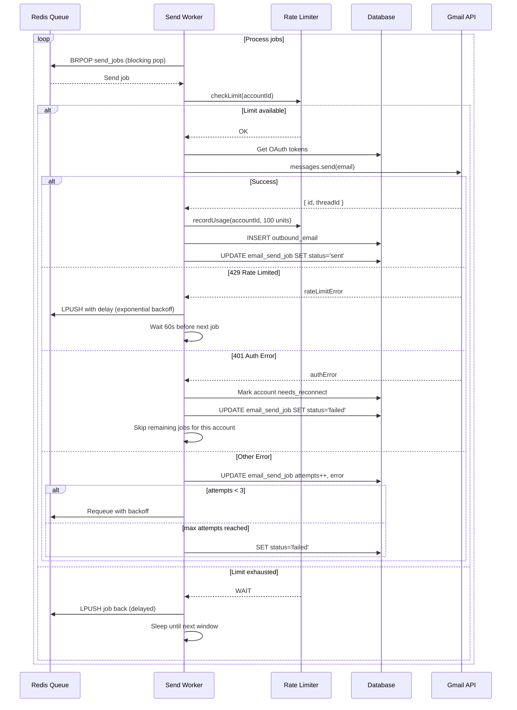
```mermaid
sequenceDiagram
    participant Queue as Redis Queue
    participant Worker as Send Worker
    participant Limiter as Rate Limiter
    participant DB as Database
    participant Gmail as Gmail API

    loop Process jobs
        Worker->>Queue: BRPOP send_jobs (blocking pop)
        Queue-->>Worker: Send job
        
        Worker->>Limiter: checkLimit(accountId)
        
        alt Limit available
            Limiter-->>Worker: OK
            Worker->>DB: Get OAuth tokens
            Worker->>Gmail: messages.send(email)
            
            alt Success
                Gmail-->>Worker: { id, threadId }
                Worker->>Limiter: recordUsage(accountId, 100 units)
                Worker->>DB: INSERT outbound_email
                Worker->>DB: UPDATE email_send_job SET status='sent'
            else 429 Rate Limited
                Gmail-->>Worker: rateLimitError
                Worker->>Queue: LPUSH with delay (exponential backoff)
                Worker->>Worker: Wait 60s before next job
            else 401 Auth Error
                Gmail-->>Worker: authError
                Worker->>DB: Mark account needs_reconnect
                Worker->>DB: UPDATE email_send_job SET status='failed'
                Worker->>Worker: Skip remaining jobs for this account
            else Other Error
                Worker->>DB: UPDATE email_send_job attempts++, error
                alt attempts < 3
                    Worker->>Queue: Requeue with backoff
                else max attempts reached
                    Worker->>DB: SET status='failed'
                end
            end
            
        else Limit exhausted
            Limiter-->>Worker: WAIT
            Worker->>Queue: LPUSH job back (delayed)
            Worker->>Worker: Sleep until next window
        end
    end
```

#### Deliverability Best Practices

| Practice | Implementation |
|----------|----------------|
| **Warm up new accounts** | Gradual increase: 20 → 50 → 100 → 200/day over weeks |
| **Randomize send times** | ±30 seconds jitter to avoid patterns |
| **Respect business hours** | Send in recipient's timezone, 9am-5pm |
| **SPF/DKIM/DMARC** | Verify sender domain setup before campaigns |
| **Unsubscribe link** | Auto-inject in footer (required by law) |
| **Bounce handling** | Track bounces, remove from future sends |
| **Reply-to threading** | Set In-Reply-To header for follow-ups |

### 3. Multi-Provider Support

The architecture supports adding more email providers:

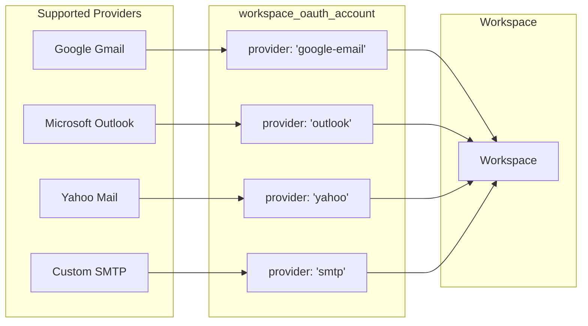
```mermaid
flowchart LR
    subgraph Providers ["Supported Providers"]
        G[Google Gmail]
        M[Microsoft Outlook]
        Y[Yahoo Mail]
        C[Custom SMTP]
    end
    
    subgraph Junction ["workspace_oauth_account"]
        J[provider: 'google-email']
        K[provider: 'outlook']
        L[provider: 'yahoo']
        N[provider: 'smtp']
    end
    
    subgraph Workspace
        W[Workspace]
    end
    
    G --> J
    M --> K
    Y --> L
    C --> N
    
    J --> W
    K --> W
    L --> W
    N --> W
```

#### Adding a New Provider

1. Add OAuth provider config to `lib/auth/auth.ts`
2. Update `OAuthProviderSchema` in `lib/onboarding/types.ts`
3. Add provider-specific API route if needed
4. Update UI to show provider option

### 4. Team Collaboration

```mermaid
flowchart TD
    subgraph Workspace ["Workspace"]
        W[Workspace Owner]
        M1[Team Member 1]
        M2[Team Member 2]
    end
    
    subgraph SharedAccounts ["Shared Email Accounts"]
        E1[sales@company.com - Primary]
        E2[support@company.com]
        E3[outreach@company.com]
    end
    
    subgraph Campaigns
        C1[Campaign A - uses sales@]
        C2[Campaign B - uses outreach@]
    end
    
    W --> |connects| E1
    W --> |connects| E2
    M1 --> |connects| E3
    
    E1 --> C1
    E3 --> C2
    
    M1 --> |uses| C1
    M2 --> |uses| C1
    M2 --> |uses| C2
```

#### Permissions Model

| Role | Can Connect | Can Set Primary | Can Remove | Can Use in Campaigns |
|------|-------------|-----------------|------------|---------------------|
| Owner | ✅ | ✅ | ✅ | ✅ |
| Admin | ✅ | ✅ | Own accounts | ✅ |
| Member | ✅ | Own accounts | Own accounts | ✅ |

---

## API Reference Summary

| Endpoint | Method | Purpose |
|----------|--------|---------|
| `/api/onboarding/{workspaceId}/check-gmail` | GET | Check if Gmail is connected during onboarding |
| `/api/onboarding/{workspaceId}/link-gmail` | POST | Link Gmail account during onboarding |
| `/api/workspaces/{workspaceId}/email-accounts` | GET | List all connected email accounts |
| `/api/workspaces/{workspaceId}/email-accounts` | POST | Link new email account to workspace |
| `/api/workspaces/{workspaceId}/email-accounts/{id}` | DELETE | Remove email account link |
| `/api/workspaces/{workspaceId}/email-accounts/{id}` | PATCH | Update account (set primary) |

---

## Implementation Checklist for Future Features

### Phase 1: Reply Detection (Push Notifications)
- [ ] Set up Google Cloud Pub/Sub topic and subscription
- [ ] Create `/api/webhooks/gmail` endpoint
- [ ] Implement `gmail.users.watch()` subscription on account connect
- [ ] Create `gmail_watch_subscription` table
- [ ] Build background worker to process notifications
- [ ] Create `outbound_email` table (tracks what we send)
- [ ] Create `email_reply` table (stores replies only)
- [ ] Implement history.list processing with thread filtering
- [ ] Add cron job for watch renewal (every 6 hours)
- [ ] Update lead status on reply detection
- [ ] Handle edge cases (out-of-office, bounces)

### Phase 2: Email Sending
- [ ] Create `email_campaign` table
- [ ] Create `email_send_job` table
- [ ] Build campaign builder UI with template editor
- [ ] Implement merge field personalization ({{firstName}}, etc.)
- [ ] Create Redis-based rate limiter (per account)
- [ ] Build send scheduler (distributes across accounts/time)
- [ ] Implement send worker with exponential backoff
- [ ] Add multi-account rotation strategies
- [ ] Create `gmail_quota_usage` tracking table
- [ ] Build account warmup system for new accounts
- [ ] Add unsubscribe link injection (legal requirement)
- [ ] Implement bounce detection and handling

### Phase 3: Analytics & UI
- [ ] Real-time send progress dashboard
- [ ] Reply rate analytics
- [ ] Account health monitoring (quota usage, errors)
- [ ] Email thread viewer (show sent + replies)
- [ ] Campaign performance reports
- [ ] A/B testing for subject lines

### Phase 4: Multi-Provider
- [ ] Add Outlook OAuth provider (`microsoft-email`)
- [ ] Abstract send logic to provider interface
- [ ] Implement Microsoft Graph API sending
- [ ] Provider-specific rate limiting
- [ ] SMTP fallback option for custom domains

### Phase 5: Team & Compliance
- [ ] Track who connected each account
- [ ] Implement role-based account permissions
- [ ] Add account usage audit log
- [ ] GDPR-compliant data retention
- [ ] CAN-SPAM compliance validation
- [ ] Domain verification for sending

---

## Data Storage Strategy

### What We Store vs What We Don't

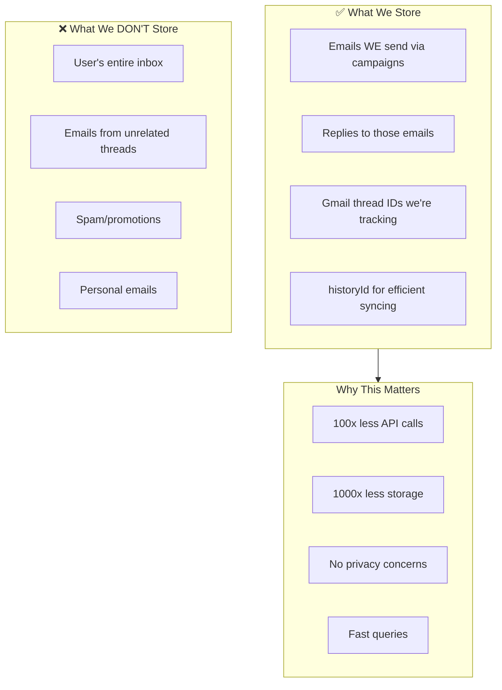
```mermaid
flowchart TD
    subgraph Store ["✅ What We Store"]
        A[Emails WE send via campaigns]
        B[Replies to those emails]
        C[Gmail thread IDs we're tracking]
        D[historyId for efficient syncing]
    end
    
    subgraph DontStore ["❌ What We DON'T Store"]
        E[User's entire inbox]
        F[Emails from unrelated threads]
        G[Spam/promotions]
        H[Personal emails]
    end
    
    subgraph Why ["Why This Matters"]
        I[100x less API calls]
        J[1000x less storage]
        K[No privacy concerns]
        L[Fast queries]
    end
    
    Store --> Why
```

### Storage Estimate Comparison

| Approach | Data per User/Month | 1000 Users/Month |
|----------|--------------------|--------------------|
| **Full inbox sync** | ~500MB (10K emails) | 500GB |
| **Our approach** | ~5MB (500 sent + 100 replies) | 5GB |

### Complete Data Model

```mermaid
erDiagram
    workspace ||--o{ workspace_oauth_account : has
    workspace_oauth_account ||--o{ outbound_email : sends
    workspace_oauth_account ||--|| gmail_watch_subscription : has
    workspace_oauth_account ||--o{ gmail_quota_usage : tracks
    outbound_email ||--o{ email_reply : receives
    email_campaign ||--o{ email_send_job : contains
    email_send_job ||--|| outbound_email : creates
    
    workspace_oauth_account {
        string id PK
        string workspaceId FK
        string accountId FK
        string provider
        string displayName
        boolean isPrimary
    }
    
    gmail_watch_subscription {
        string id PK
        string workspaceOAuthAccountId FK
        string historyId
        timestamp expiresAt
    }
    
    outbound_email {
        string id PK
        string senderAccountId FK
        string gmailThreadId
        string gmailMessageId
        string leadId
        string campaignId
        boolean hasReply
        integer replyCount
    }
    
    email_reply {
        string id PK
        string outboundEmailId FK
        string gmailMessageId
        string fromEmail
        string snippet
        timestamp receivedAt
    }
    
    email_campaign {
        string id PK
        string workspaceId FK
        string status
        string subject
        integer sentCount
        integer replyCount
    }
    
    email_send_job {
        string id PK
        string campaignId FK
        string leadId
        string status
        timestamp scheduledAt
        timestamp sentAt
    }
```

---

## Architecture Decision Records (ADRs)

### ADR-001: Push Notifications vs Polling
**Decision**: Use Gmail Push Notifications (Pub/Sub) instead of polling.

**Rationale**:
- Polling 1000 accounts every minute = 1.44M API calls/day
- Push notifications = only when emails actually arrive (~50K/day)
- Near real-time reply detection vs up to 60s delay
- Much lower risk of rate limiting

### ADR-002: Track Only Our Emails
**Decision**: Only store emails sent by our platform and replies to them.

**Rationale**:
- User's inbox may have 10,000+ emails - we don't need them
- Privacy: we shouldn't access unrelated emails
- Storage: only store what's relevant to campaigns
- Performance: faster queries, smaller database

### ADR-003: Rate Limiting Strategy
**Decision**: Conservative limits with per-account token bucket.

**Rationale**:
- Gmail suspends accounts for abuse - better safe than sorry
- Free accounts: 15/min (75% of 20 limit)
- Workspace: 80/min (80% of 100 limit)
- Daily buffer: 90% of stated limits
- Exponential backoff on any 429 response

