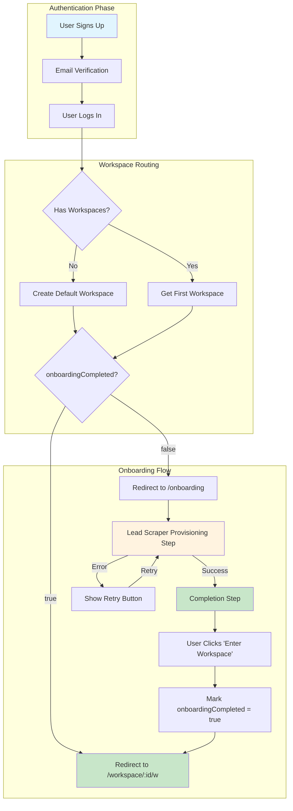
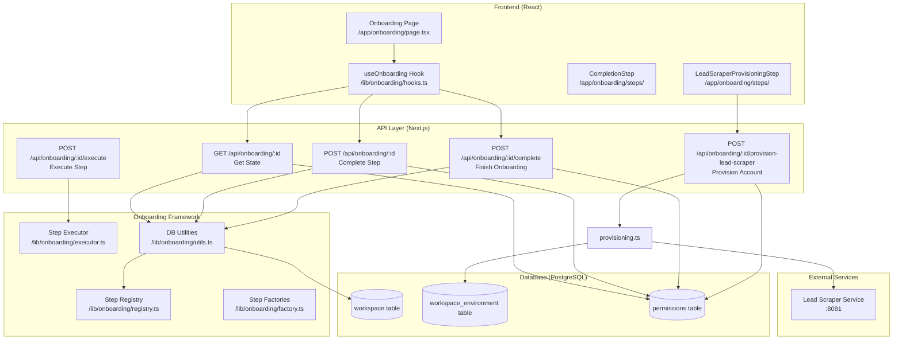
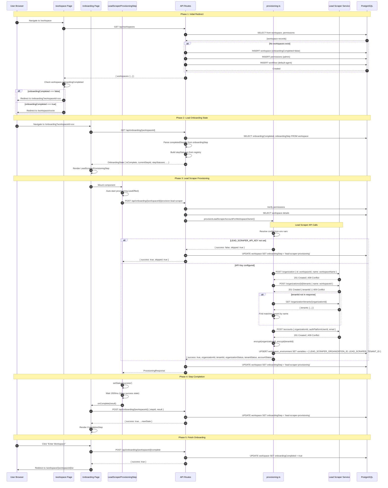
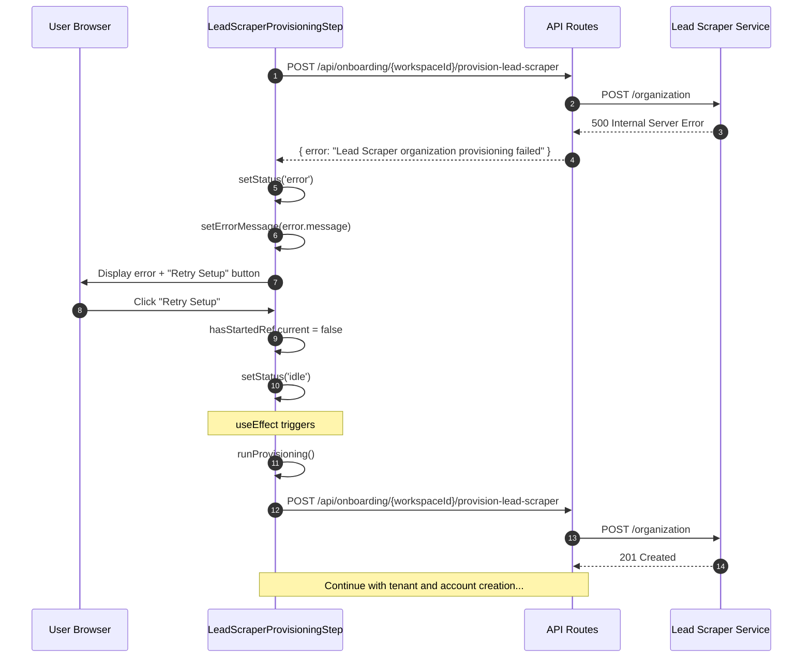
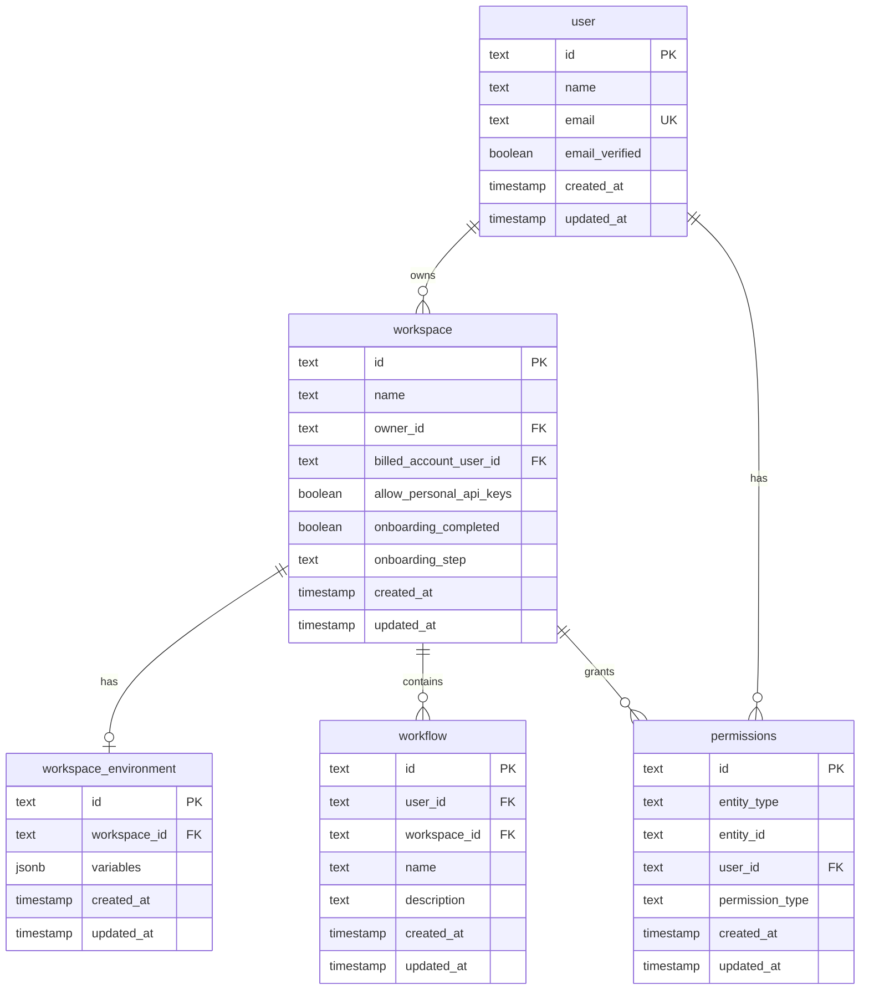
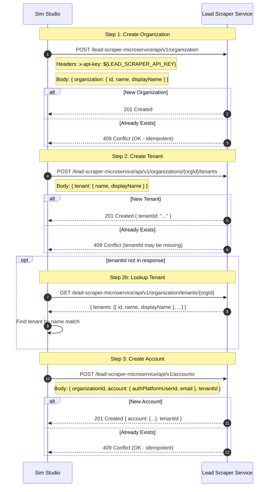
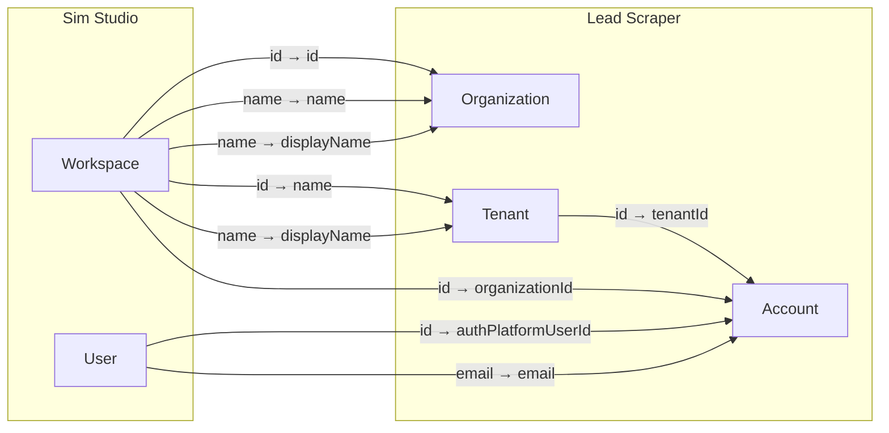
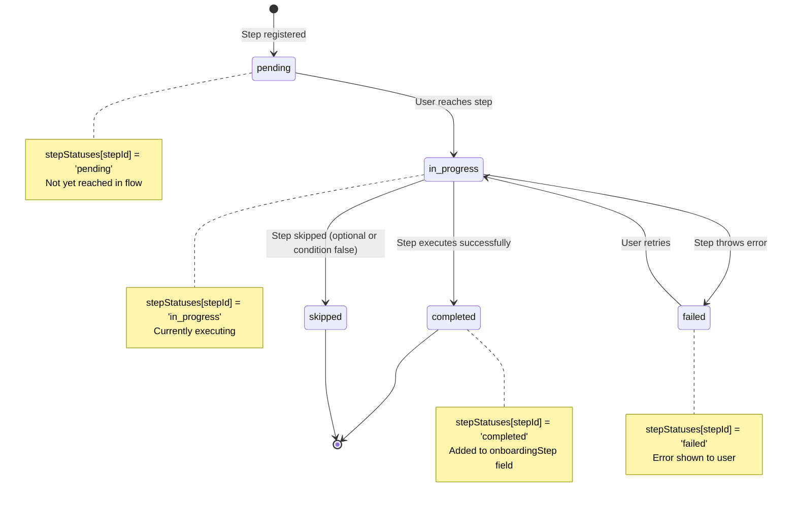
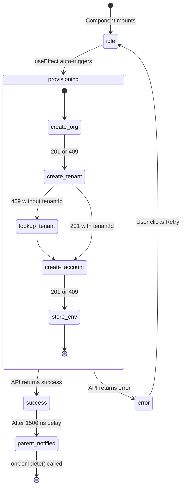
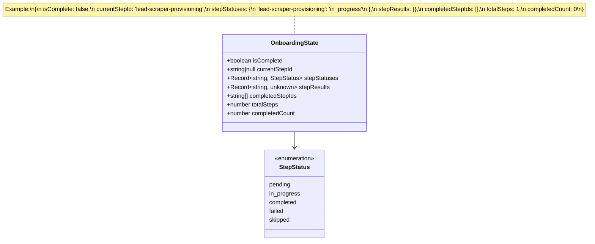

# Onboarding Workflow Documentation

This document provides a comprehensive visual guide to the onboarding system, detailing every step, API call, database interaction, and data flow.

## Table of Contents

1. [High-Level User Journey](#1-high-level-user-journey)
2. [System Architecture](#2-system-architecture)
3. [Detailed Sequence Diagram](#3-detailed-sequence-diagram)
4. [Database Schema & Records](#4-database-schema--records)
5. [Lead Scraper API Interactions](#5-lead-scraper-api-interactions)
6. [Step-by-Step State Machine](#6-step-by-step-state-machine)
7. [File Structure & Responsibilities](#7-file-structure--responsibilities)
8. [Data Flow Summary](#8-data-flow-summary)

---

## 1. High-Level User Journey



---

## 2. System Architecture



---

## 3. Detailed Sequence Diagram

### 3.1 Complete Onboarding Flow



### 3.2 Error & Retry Flow



---

## 4. Database Schema & Records

### 4.1 Tables Involved



### 4.2 Record States During Onboarding

```mermaid
stateDiagram-v2
    [*] --> WorkspaceCreated: POST /api/workspaces
    
    state WorkspaceCreated {
        [*] --> Initial
        
        state "workspace table" as WT1 {
            Initial: id = uuid
            Initial: name = "User's Workspace"
            Initial: owner_id = user.id
            Initial: onboarding_completed = false
            Initial: onboarding_step = null
        }
        
        state "permissions table" as PT1 {
            PermCreated: entity_type = 'workspace'
            PermCreated: entity_id = workspace.id
            PermCreated: user_id = user.id
            PermCreated: permission_type = 'admin'
        }
        
        Initial --> PermCreated
    }
    
    WorkspaceCreated --> ProvisioningComplete: Lead Scraper Step
    
    state ProvisioningComplete {
        state "workspace table" as WT2 {
            StepDone: onboarding_step = 'lead-scraper-provisioning'
        }
        
        state "workspace_environment table" as WE1 {
            EnvSet: variables = {
            EnvSet: "LEAD_SCRAPER_ORGANIZATION_ID": encrypted(orgId)
            EnvSet: "LEAD_SCRAPER_TENANT_ID": encrypted(tenantId)
            EnvSet: }
        }
    }
    
    ProvisioningComplete --> OnboardingComplete: Finish Onboarding
    
    state OnboardingComplete {
        state "workspace table" as WT3 {
            Complete: onboarding_completed = true
        }
    }
    
    OnboardingComplete --> [*]
```

### 4.3 Sample Data at Each Stage

#### Stage 1: After Workspace Creation

```sql
-- workspace table
INSERT INTO workspace VALUES (
    'ws_abc123',                    -- id
    'John''s Workspace',            -- name
    'user_xyz789',                  -- owner_id
    'user_xyz789',                  -- billed_account_user_id
    true,                           -- allow_personal_api_keys
    false,                          -- onboarding_completed ← KEY FIELD
    null,                           -- onboarding_step ← No steps completed yet
    '2026-01-01 10:00:00',         -- created_at
    '2026-01-01 10:00:00'          -- updated_at
);

-- permissions table
INSERT INTO permissions VALUES (
    'perm_111',
    'workspace',
    'ws_abc123',
    'user_xyz789',
    'admin',
    '2026-01-01 10:00:00',
    '2026-01-01 10:00:00'
);
```

#### Stage 2: After Lead Scraper Provisioning

```sql
-- workspace table (updated)
UPDATE workspace SET
    onboarding_step = 'lead-scraper-provisioning',  -- Step ID added
    updated_at = '2026-01-01 10:00:15'
WHERE id = 'ws_abc123';

-- workspace_environment table (new or updated)
INSERT INTO workspace_environment VALUES (
    'env_222',
    'ws_abc123',
    '{
        "LEAD_SCRAPER_ORGANIZATION_ID": "encrypted:abc123...",
        "LEAD_SCRAPER_TENANT_ID": "encrypted:def456..."
    }',
    '2026-01-01 10:00:15',
    '2026-01-01 10:00:15'
) ON CONFLICT (workspace_id) DO UPDATE SET
    variables = EXCLUDED.variables,
    updated_at = EXCLUDED.updated_at;
```

#### Stage 3: After Onboarding Complete

```sql
-- workspace table (final state)
UPDATE workspace SET
    onboarding_completed = true,  -- ← NOW TRUE
    updated_at = '2026-01-01 10:00:30'
WHERE id = 'ws_abc123';
```

---

## 5. Lead Scraper API Interactions

### 5.1 API Call Sequence



### 5.2 Request/Response Details

#### Create Organization

```
POST /lead-scraper-microservice/api/v1/organization
Headers:
  Content-Type: application/json
  x-api-key: sk_live_xxxx

Request Body:
{
  "organization": {
    "id": "ws_abc123",           // Workspace ID as org ID
    "name": "John's Workspace",
    "displayName": "John's Workspace"
  }
}

Response (201 Created):
{}  // Empty body on success

Response (409 Conflict):
{
  "error": "Organization already exists"
}
```

#### Create Tenant

```
POST /lead-scraper-microservice/api/v1/organizations/{orgId}/tenants
Headers:
  Content-Type: application/json
  x-api-key: sk_live_xxxx

Request Body:
{
  "tenant": {
    "name": "ws_abc123",
    "displayName": "John's Workspace"
  }
}

Response (201 Created):
{
  "tenantId": "tenant_xyz789"
}
```

#### Create Account

```
POST /lead-scraper-microservice/api/v1/accounts
Headers:
  Content-Type: application/json
  x-api-key: sk_live_xxxx

Request Body:
{
  "organizationId": "ws_abc123",
  "account": {
    "authPlatformUserId": "user_xyz789",
    "email": "john@example.com"
  },
  "initialWorkspaceName": "John's Workspace",
  "tenantId": "tenant_xyz789"
}

Response (201 Created):
{
  "account": {
    "id": "acc_111",
    "authPlatformUserId": "user_xyz789"
  },
  "tenantId": "tenant_xyz789"
}
```

### 5.3 Data Mapping



---

## 6. Step-by-Step State Machine

### 6.1 Onboarding Step States



### 6.2 Lead Scraper Provisioning Step Internals



### 6.3 OnboardingState Object Structure



---

## 7. File Structure & Responsibilities

```mermaid
flowchart TB
    subgraph "lib/onboarding/ - Framework Core"
        types[types.ts<br/>━━━━━━━━━━━━━<br/>• Zod schemas<br/>• TypeScript types<br/>• API request/response shapes]
        
        registry[registry.ts<br/>━━━━━━━━━━━━━<br/>• Step storage Map<br/>• Step validation<br/>• Step queries]
        
        factory[factory.ts<br/>━━━━━━━━━━━━━<br/>• createApiStep()<br/>• createOAuthStep()<br/>• createFormStep()]
        
        executor[executor.ts<br/>━━━━━━━━━━━━━<br/>• Step execution<br/>• Data validation<br/>• Error handling<br/>• Rollback support]
        
        utils[utils.ts<br/>━━━━━━━━━━━━━<br/>• getOnboardingState()<br/>• markStepCompleted()<br/>• markOnboardingComplete()<br/>• DB queries]
        
        hooks[hooks.ts<br/>━━━━━━━━━━━━━<br/>• useOnboarding()<br/>• useOnboardingStep()<br/>• Client-side state]
        
        access[access.ts<br/>━━━━━━━━━━━━━<br/>• verifyWorkspaceAccess()<br/>• Permission checks]
    end
    
    subgraph "lib/onboarding/steps/ - Step Definitions"
        lsp[lead-scraper-provisioning.ts<br/>━━━━━━━━━━━━━<br/>• Step config<br/>• Result schema<br/>• API endpoint]
        
        idx[index.ts<br/>━━━━━━━━━━━━━<br/>• Step registration<br/>• stepRegistry.register()]
    end
    
    subgraph "app/onboarding/ - UI"
        page[page.tsx<br/>━━━━━━━━━━━━━<br/>• Main page<br/>• Step rendering<br/>• Navigation]
        
        layout[components/onboarding-layout.tsx<br/>━━━━━━━━━━━━━<br/>• Page layout<br/>• Header/footer]
        
        indicator[components/step-indicator.tsx<br/>━━━━━━━━━━━━━<br/>• Progress display<br/>• Step status icons]
        
        lsui[steps/lead-scraper-provisioning-step.tsx<br/>━━━━━━━━━━━━━<br/>• Provisioning UI<br/>• Auto-execute<br/>• Retry handling]
        
        compui[steps/completion-step.tsx<br/>━━━━━━━━━━━━━<br/>• Success message<br/>• Enter Workspace button]
    end
    
    subgraph "app/api/onboarding/ - API Routes"
        route[route.ts<br/>━━━━━━━━━━━━━<br/>• GET state<br/>• POST complete step]
        
        complete[complete/route.ts<br/>━━━━━━━━━━━━━<br/>• POST finish onboarding]
        
        provision[provision-lead-scraper/route.ts<br/>━━━━━━━━━━━━━<br/>• POST provision account]
        
        execute[execute/route.ts<br/>━━━━━━━━━━━━━<br/>• POST execute step]
    end
    
    subgraph "lib/lead-scraper/"
        prov[provisioning.ts<br/>━━━━━━━━━━━━━<br/>• Lead Scraper API calls<br/>• Env var storage<br/>• Encryption]
    end
    
    types --> registry
    types --> factory
    types --> executor
    types --> utils
    types --> hooks
    
    registry --> utils
    registry --> executor
    
    factory --> lsp
    
    lsp --> idx
    idx --> registry
    
    hooks --> page
    page --> lsui
    page --> compui
    
    route --> utils
    complete --> utils
    provision --> prov
    execute --> executor
```

---

## 8. Data Flow Summary

### 8.1 Complete Data Flow Diagram

```mermaid
flowchart TB
    subgraph "User Actions"
        UA1[Sign Up / Login]
        UA2[Visit /workspace]
        UA3[Auto-redirect to /onboarding]
        UA4[Watch provisioning]
        UA5[Click Enter Workspace]
    end
    
    subgraph "API Calls"
        A1[GET /api/workspaces]
        A2[POST /api/workspaces - if needed]
        A3[GET /api/onboarding/:id]
        A4[POST /api/onboarding/:id/provision-lead-scraper]
        A5[POST /api/onboarding/:id]
        A6[POST /api/onboarding/:id/complete]
    end
    
    subgraph "Database Operations"
        D1[SELECT workspace, permissions]
        D2[INSERT workspace, permissions, workflow]
        D3[SELECT workspace onboarding state]
        D4[INSERT/UPDATE workspace_environment]
        D5[UPDATE workspace.onboardingStep]
        D6[UPDATE workspace.onboardingCompleted = true]
    end
    
    subgraph "External APIs"
        L1[POST /organization]
        L2[POST /organizations/:id/tenants]
        L3[GET /organization/tenants/:id]
        L4[POST /accounts]
    end
    
    subgraph "Data Stored"
        S1[workspace.id<br/>workspace.name<br/>workspace.onboardingCompleted = false]
        S2[permissions.entity_id = workspace.id<br/>permissions.permission_type = 'admin']
        S3[workspace.onboardingStep = 'lead-scraper-provisioning']
        S4[workspace_environment.variables = {<br/>  LEAD_SCRAPER_ORGANIZATION_ID,<br/>  LEAD_SCRAPER_TENANT_ID<br/>}]
        S5[workspace.onboardingCompleted = true]
    end
    
    UA1 --> UA2
    UA2 --> A1
    A1 --> D1
    D1 -->|No workspace| A2
    A2 --> D2
    D2 --> S1
    D2 --> S2
    
    D1 -->|onboardingCompleted=false| UA3
    A2 -->|onboardingCompleted=false| UA3
    
    UA3 --> A3
    A3 --> D3
    
    UA4 --> A4
    A4 --> L1
    A4 --> L2
    L2 -->|No tenantId| L3
    A4 --> L4
    A4 --> D4
    D4 --> S4
    
    A4 --> A5
    A5 --> D5
    D5 --> S3
    
    UA5 --> A6
    A6 --> D6
    D6 --> S5
```

### 8.2 Environment Variables Required

| Variable | Purpose | Example |
|----------|---------|---------|
| `LEAD_SCRAPER_API_KEY` | API key for Lead Scraper service authentication | `sk_live_abc123...` |
| `LEAD_SCRAPER_BASE_URL` | Base URL of Lead Scraper service | `http://localhost:8081` |
| `LEAD_SCRAPER_API_PREFIX` | API path prefix | `/lead-scraper-microservice/api/v1` |

### 8.3 Encrypted Environment Variables Stored

| Key | Value | Purpose |
|-----|-------|---------|
| `LEAD_SCRAPER_ORGANIZATION_ID` | Encrypted workspace ID | Required for all Lead Scraper API calls |
| `LEAD_SCRAPER_TENANT_ID` | Encrypted tenant ID from Lead Scraper | Required for all Lead Scraper API calls |

---

## Appendix: Adding New Onboarding Steps

To add a new step (e.g., Gmail connection):

1. **Create step definition** in `lib/onboarding/steps/gmail-connection.ts`
2. **Create UI component** in `app/onboarding/steps/gmail-connection-step.tsx`
3. **Register step** in `lib/onboarding/steps/index.ts`
4. **Add to page UI** in `app/onboarding/page.tsx`

The framework handles:
- ✅ Step ordering
- ✅ Dependency resolution
- ✅ Condition checking
- ✅ State persistence
- ✅ Error handling
- ✅ Retry logic

---

*Last updated: January 1, 2026*

